Circuit diagrams and firmware source code for Gboard DIY keyboards, previously
known as Google Japanese Input / Gboard April Fools.

This is not an officially supported Google product.

# Products

Please refer to the README in each directory for more details.

<table>
<tr>
<td>

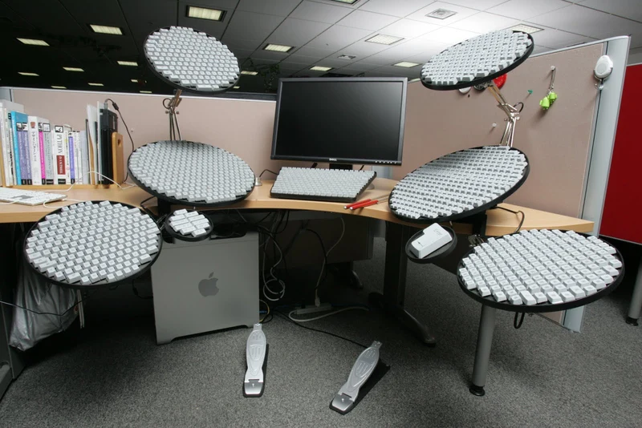

[Google 日本語入力 ドラムセットバージョン](https://archive.google/drumsetkeyboard/) 
[Google Japanese Input Drum set version](https://archive.google/drumsetkeyboard/)

変換の煩わしさを感じさせない思いどおりの日本語入力を提供します。

- [Announce](https://blog.google/intl/ja-jp/products/android-chrome-play/2010_04_google/)
- Release date: Apr 1, 2010
- Source: Not open source

</td>
<td>

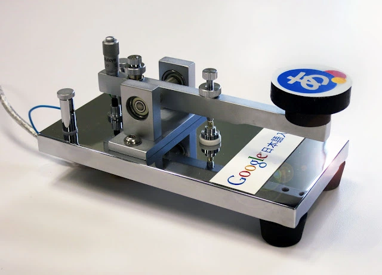

[Google 日本語入力 モールスバージョン](http://www.google.co.jp/ime/-.-.html) 
[Google Japanese Input Morse version](http://www.google.co.jp/ime/-.-.html)

モールス符号で思いどおりの日本語入力

- [Promotional video](https://www.youtube.com/watch?v=u5AYb778pwA)
- [Announce](https://japan.googleblog.com/2012/04/google.html)
- [Technical details](http://googledevjp.blogspot.jp/2012/06/google.html)
- Release date: Apr 1, 2012
- Source: [/third_party/mozc-morse](./third_party/mozc-morse)

</td>
</tr>
<tr>
<td>

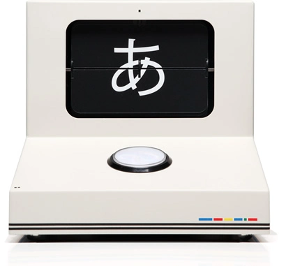

[Google 日本語入力 パタパタバージョン](http://www.google.co.jp/ime/patapata/) 
[Google Japanese Input Patapata version](http://www.google.co.jp/ime/patapata/)

もう、なにも覚える必要はありません。
押して離すだけの日本語入力。

- [Promotional video](https://www.youtube.com/watch?v=HzUDAaYMNsA)
- [Announce](https://japan.googleblog.com/2013/04/google-patapata.html)
- [Technical details](http://googledevjp.blogspot.jp/2013/10/google.html)
- Release date: Apr 1, 2013
- Source: [/third_party/mozc-flap](./third_party/mozc-flap)

</td>
<td>

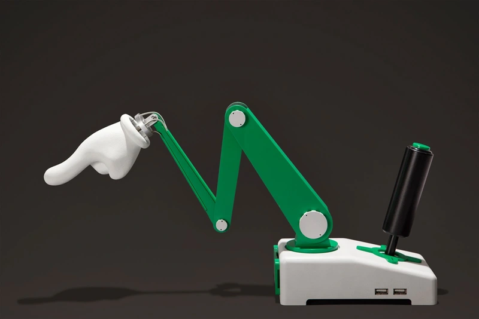

[Google 日本語入力 マジックハンドバージョン](https://archive.google/ime/m9/) 
[Google Japanese Input Magic hand version](https://archive.google/ime/m9/)

マジックハンドでらくらく入力

- [Promotional video](https://www.youtube.com/watch?v=0u1zoaJYAmw)
- [Announce](https://blog.google/intl/ja-jp/products/android-chrome-play/2014_04_m9/)
- Release date: Apr 1, 2016
- Source: Not open source

</td>
</tr>
<tr>
<td>

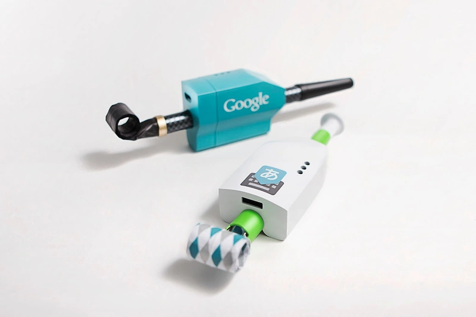

[Google 日本語入力 ピロピロバージョン](https://www.google.co.jp/ime/___o/) 
[Google Japanese Input Piropiro version](https://www.google.co.jp/ime/___o/)

もうキーはいらない

- [Promotional video](https://www.youtube.com/watch?v=gAgOnQqyDz0)
- [Announce](https://japan.googleblog.com/2015/04/piropiro.html)
- Release date: Apr 1, 2015
- Source: [/mozc-piropiro](./mozc-piropiro)

</td>
<td>

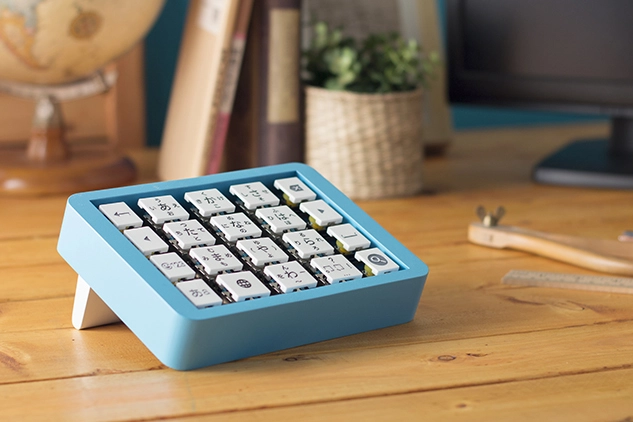

[Google 日本語入力 物理フリックバージョン](https://www.google.co.jp/ime/furikku/) 
[Google Japanese Input Physical Flick version](https://www.google.co.jp/ime/furikku/)

さわれるフリック

- [Promotional video](https://www.youtube.com/watch?v=5LI1PysAlkU)
- [Announce](https://japan.googleblog.com/2016/04/furikku.html)
- Release date: Apr 1, 2016
- Source: [/mozc-furikku](./mozc-furikku)

</td>
</tr>
<tr>
<td>

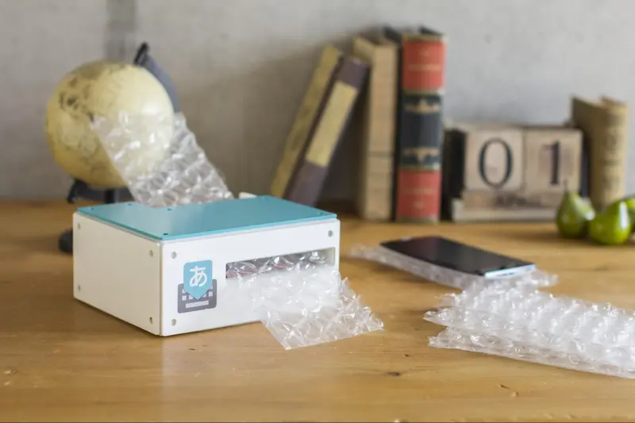

[日本語入力 プチプチバージョン](https://landing.google.co.jp/ime/ooooo/) 
[Google Japanese Input Puchi Puchi version](https://landing.google.co.jp/ime/ooooo/)

空気のように、軽やかな入力。

- [Promotional video](https://www.youtube.com/watch?v=RkJZDvHMyTA)
- [Announce](https://japan.googleblog.com/2017/04/ooooo.html)
- Release date: Apr 1, 2017
- Source: [/third_party/mozc-puchi](./third_party/mozc-puchi)

</td>
<td>

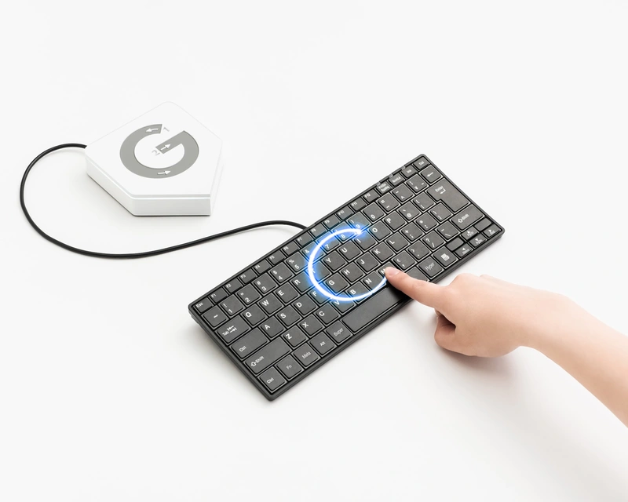

[Gboard 物理手書きバージョン](https://landing.google.co.jp/tegaki/) 
[Gboard Physical Handwriting version](https://landing.google.co.jp/tegaki/)

新しいタイプの手書き入力。

- [Promotional video](https://www.youtube.com/watch?v=guJnFY1R4I0)
- [Announce](https://japan.googleblog.com/2018/04/tegaki.html)
- [Technical details](https://developers-jp.googleblog.com/2018/04/tegaki.html)
- Release date: Apr 1, 2018
- Source: [/mozc-nazoru](./mozc-nazoru)

</td>
</tr>
<tr>
<td>

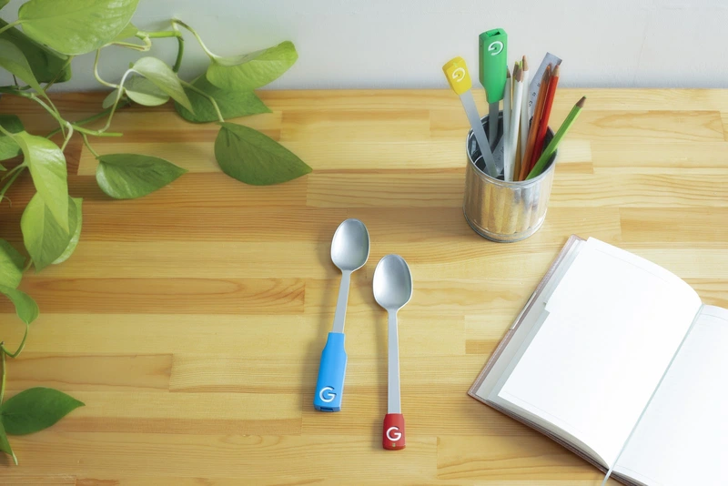

[Gboard スプーン曲げバージョン](https://landing.google.co.jp/---o/) 
[Gboard Spoon Bending version](https://landing.google.co.jp/---o/)

タネも仕掛けもない、柔軟な入力。

- [Promotional video](https://www.youtube.com/watch?v=DeJY5d14qKs)
- [Announce](https://japan.googleblog.com/2019/04/mageru.html)
- Release date: Apr 1, 2019
- Source:
  - [/mozc-mageru](./mozc-mageru) for firmware, schematics, and PCB layout.
  - [/third_party/mozc-mageru](./third_party/mozc-mageru) for 3D model.

</td>
<td>

[Gboard 湯呑みバージョン](https://g.co/yunomi/) 
[Gboard yunomi version](https://g.co/yunomi/)

もう、おすしかない。

- [Promotional video](https://www.youtube.com/watch?v=20pC05yisRM)
- [Announce](https://japan.googleblog.com/2021/10/gboard.html)
- Release date: Oct 1, 2021
- Source: [/mozc-yunomi](./mozc-yunomi)

</td>
</tr>
<tr>
<td>

[Gboard 棒バージョン](https://g.co/____) 
[Gboard bar version](https://g.co/____)

キーの次はボーです。

- [Promotional video](https://www.youtube.com/watch?v=9G3DWHf1xX0)
- [Announce](https://japan.googleblog.com/2022/10/gboard-2022.html)
- Release date: Oct 1, 2022
- Source: [/mozc-bar](./mozc-bar)

</td>
<td>

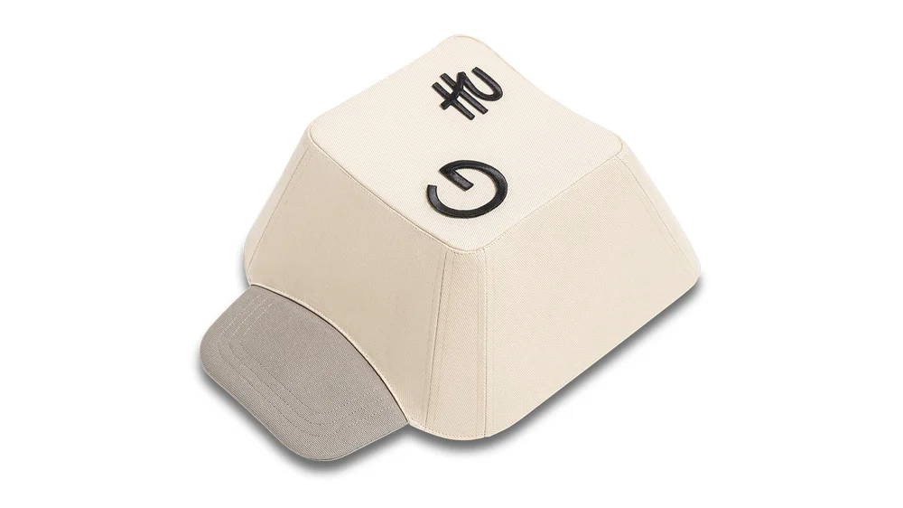

[Gboard 帽バージョン](https://g.co/CAPS) 
[Gboard CAPS version](https://g.co/CAPS)

入力は、帽険だ。

- [Promotional video](https://www.youtube.com/watch?v=6vib77CUxNM)
- [Announce](https://japan.googleblog.com/2023/10/caps.html)
- Release date: Oct 1, 2023
- Source: [/mozc-caps](./mozc-caps)

</td>
</tr>
<tr>
<td>

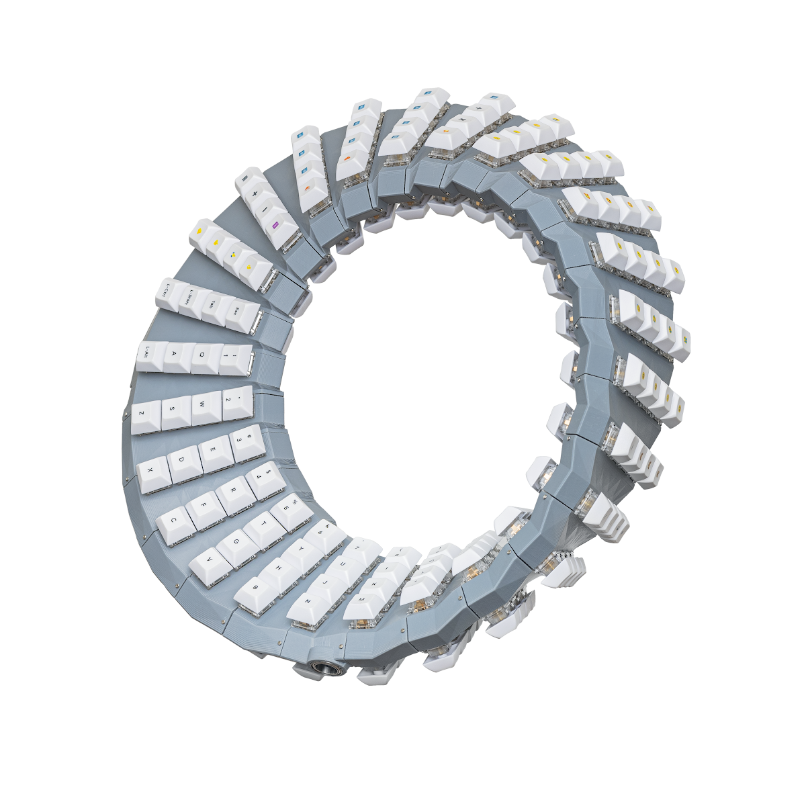

[Gboard 両面バージョン](https://g.co/double-sided) 
[Gboard double sided version](https://g.co/double-sided)

表面かと思ったら裏面でした。

- [Promotional video](https://www.youtube.com/watch?v=EHqPrHTN1dU)
- [Announce](https://blog.google/intl/ja-jp/products/android-chrome-play/gboard-2024)
- Release date: Oct 1, 2024
- Source: [/mozc-doublesided](./mozc-doublesided)

</td>
<td>

</td>
</tr>
</table>
