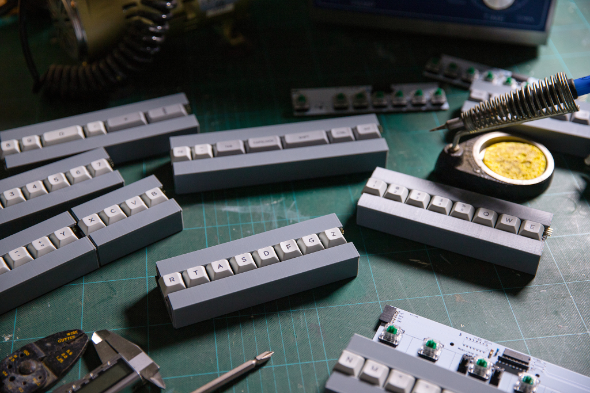
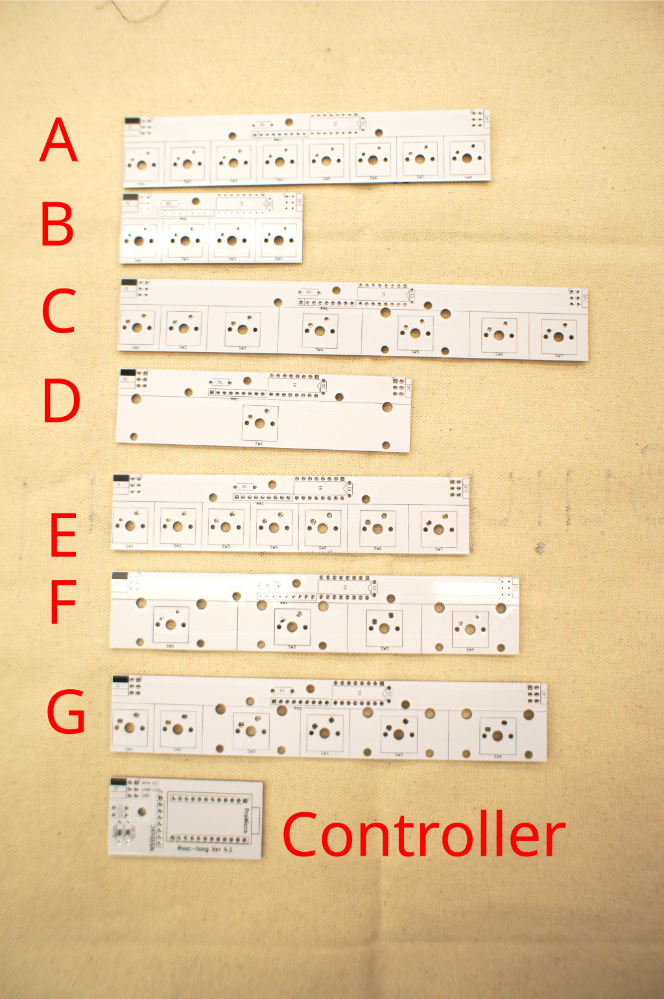
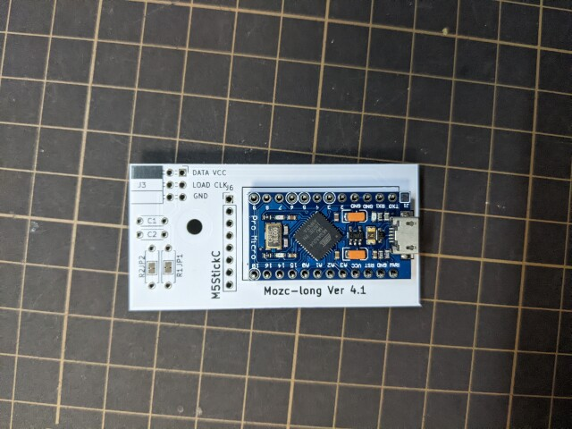
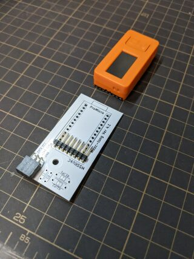
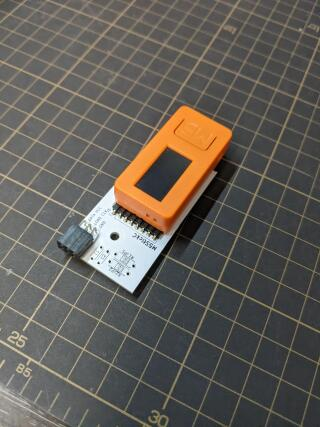
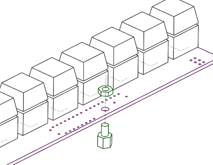
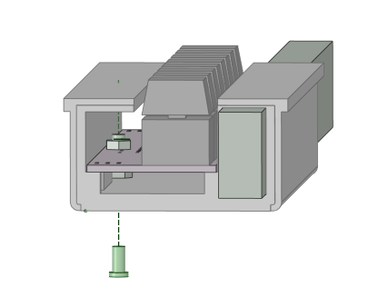

# Gboard Bar version

This directory contains programs, schematics and board layouts for Gboard Bar version,
which was released on **Oct 1, 2022**.

This is not an officially supported Google product.



## Contents

The directory structure is as follows:

- board/ : KiCad schematics and PCB layouts.
- case/ : STL file for case.
- firmware/ : Arduino sketch.

## Building Gboard Bar Version

### Parts

- [Cherry MX (or compatible) key](https://shop.yushakobo.jp/collections/all-switches/cherry-mx-%E4%BA%92%E6%8F%9B-%E3%82%B9%E3%82%A4%E3%83%83%E3%83%81) x 101
- [Stabilizer](https://shop.yushakobo.jp/collections/all-keyboard-parts/products/a0500st?variant=37665699463329) 2u x 7
- [Stabilizer](https://shop.yushakobo.jp/collections/all-keyboard-parts/products/a0500st?variant=37665699463329) 6.25u x 1
- [74HC165](https://akizukidenshi.com/catalog/g/gI-14679/) x 16
- [Resistor 100kOhm](https://akizukidenshi.com/catalog/g/gR-25104/) x 16
- [Resistor network 100kOhm](https://akizukidenshi.com/catalog/g/gR-14228/) x 16
- [Capacitor 0.1uF](https://akizukidenshi.com/catalog/g/gP-10147/) x 16
- 2 row 3 column right angle 2.54mm pin headers x 16 ([Cut from this](https://akizukidenshi.com/catalog/g/gC-10903/))
- 2 row 3 column right angle 2.54mm pin header sockets x 16 ([Cut from this](https://akizukidenshi.com/catalog/g/gC-05756/))
- 20 mm width x 10 mm height extruded aluminium frame 2389.75mm in length (needed length may vary slightly based on 3D printing size variance)
- [M3 6mm slim head screw](https://jp.misumi-ec.com/vona2/detail/221000546066) x 16
- [M3 5mm Spacer](https://akizukidenshi.com/catalog/g/gP-07471/) x 16
- [M3 nut](https://akizukidenshi.com/catalog/g/gP-07468/) x 16
- Keycap (US) x 1set
- If building the wired version.
  - ProMicro x 1
  - Pin header 12pin x 2
- If building the wireless version.
  - M5StickC (or M5StickC PLUS) x 1
  - Right angle pin header 8pin x 1

#### Aluminium Frame

These for making frame:

- [HFSFIN5-1020](https://jp.misumi-ec.com/vona2/detail/110302374340/)
  - Multiple extruded aluminium frames can be connected together using [straight line connectors](https://jp.misumi-ec.com/vona2/detail/110302248430). For example, you may choose to order three 0.8m-ish frames instead of a single 2.4m frame.
  - However, the bottom holes of the cases cannot be used for fastening them to the frame. Additional machining would be needed. (e.g. dig some hole to the frame, or use glue instead, etc.)
- [AFS-1020-4](https://jp.misumi-ec.com/vona2/detail/221005476984/)
  - [NHG-04-3 square nuts](https://jp.misumi-ec.com/vona2/detail/221005480709/) and M3 flat-headed screws can be used for fastening each module to the frame.
  - However, parts for connecting these frames are not available. Purchasing a 2.4m-length frame may be problematic.
  - We have not actually tried this yet.

### PCBs

We need the following quantities of each kind of PCB:



- Controller x 1
- Key switch Type A x 9
- Key switch Type B x 2
- Key switch Type C x 1
- Key switch Type D x 1
- Key switch Type E x 1
- Key switch Type F x 1
- Key switch Type G x 1

### Case

The following quantities of each type of 3D print case:

- case/left-tip.stl x 1
- case/typeA.stl x 9
- case/typeB.stl x 2
- case/typeC.stl x 1
- case/typeD.stl x 1
- case/typeE.stl x 1
- case/typeF.stl x 1
- case/typeG.stl x 1
- case/controller.stl x 1
- case/right-tip.stl x 1

### Steps to build

#### Step 1

Solder 74HC165, resistors, resistor networks, capacitors, connectors and keyswitches to keyswitch PCBs.

#### Step 2

Add stabilizer and keycaps.

Here is the default keymap:


#### Step 3

Solder pin header and/or pro micro to controller PCB.

Wired version (Use ProMicro):



Wireless version (Use M5StickC):




#### Step 4

Attach each PCB to 3D printed case using M3 bolt and spacer.





#### Step 5

Thread the aluminium frame through the square holes of the 3D printed cases to join them together.

#### Step 6

Install firmware using the Arduino IDE.

NOTE: For the wireless version (M5Stack), an additional library is needed:
[ESP32 BLE Keyboard library](https://github.com/T-vK/ESP32-BLE-Keyboard)

#### Step 7

Connect the keyboard to a PC or other device that has Google Japanese
Input/Gboard installed.

## License

```
Licensed under the Apache License, Version 2.0 (the "License"); you may
not use this file except in compliance with the License. You may obtain
a copy of the License at

    http://www.apache.org/licenses/LICENSE-2.0

Unless required by applicable law or agreed to in writing, software
distributed under the License is distributed on an "AS IS" BASIS,
WITHOUT WARRANTIES OR CONDITIONS OF ANY KIND, either express or implied.
See the License for the specific language governing permissions and
limitations under the License.
```
