# Gboard CAPS version

This directory contains the firmware and hardware design for Gboard CAPS
version, which was released on **Oct 1, 2023**.

This is not an officially supported Google product.

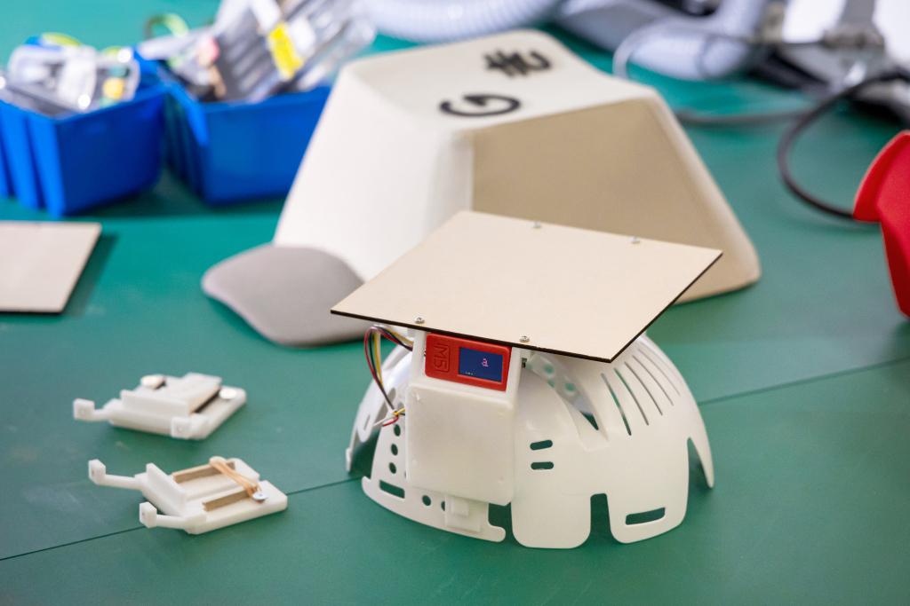

## Contents

The directory structure is as follows:

- hardware/ : STL files for mechanical parts.
- firmware/ : Arduino sketch.

## Building Gboard CAPS Version

### Parts

- M5StickC Plus
- SS-10GL13 micro switch
- [INC-100 bump cap insert](https://www.midori-helmet.jp/pickup/inc-100/)
- [Grove connector cable](https://akizukidenshi.com/catalog/g/gC-16938/)
- M3x10mm screw x 8
- M2x8mm screw x 2
- rubber band x 4
- hot glue
- heat shrink tubing
- 160mm x 160mm x T2.5mm MDF board (or substitute a 3D printed part; see next
  section)

### Hardware

#### Step 1: Prepare required parts

3D printed parts:

- [bump cap insert mount](./hardware/bump_cap_insert_mount.stl) x 2
  \
  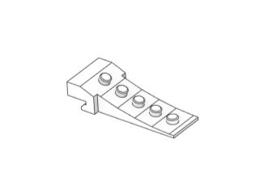
- [sliding plate](./hardware/sliding_plate.stl) x 2
  \
  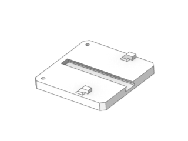
- [top plate angle bracket mount](./hardware/top_plate_angle_bracket_mount.stl)
  x 2
  \
  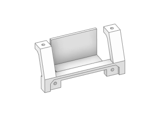
- [switch mount](./hardware/switch_mount.stl) x 1
  \
  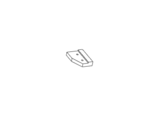

Other parts:

- top plate: made of 160mm x 160mm x T2.5mm MDF board
  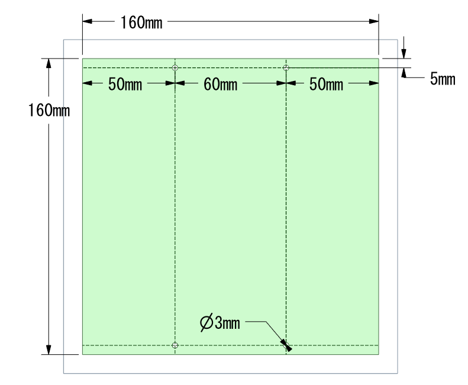 \
  Alternatively, you can 3D print this
  part ([top_plate.stl](./hardware/top_plate.stl))

#### Step 2: Wiring

Connect the NO and the C terminals of the micro switch to the black and yellow
wires of the Grove cable, in any order. (These will be connected to port G33 and
GND of M5StickC Plus.)
\
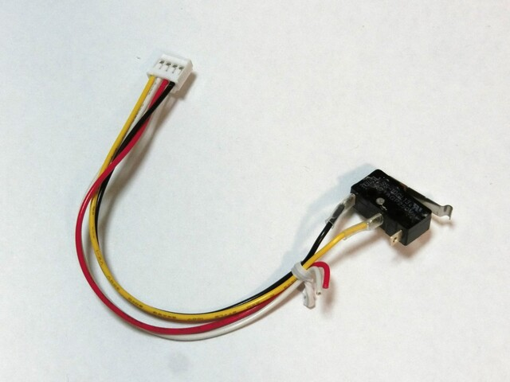

#### Step 3: Build

1. Put 2 rubber bands across the two latches on the sliding plates.
   \
   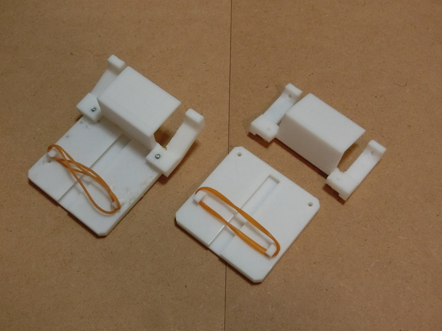

1. Attach one of the top plate angle bracket mounts to one of the sliding plates
   and fasten using M3 screws. Repeat for the other set.
   \
   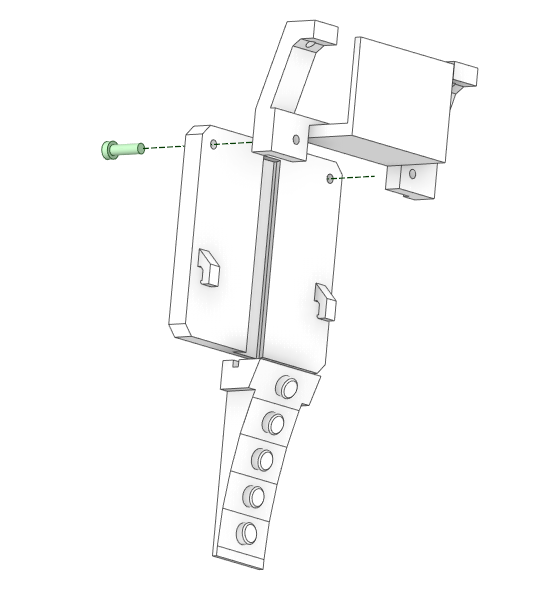

1. Fasten the angle bracket mount and sliding plate assemblies to the top plate
   using M3 screws \
   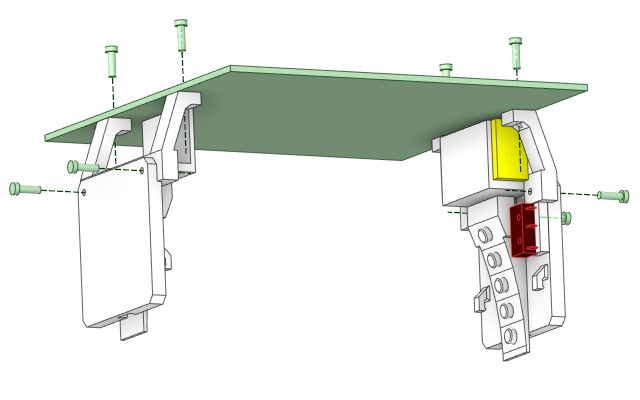
   \
   

1. Screw the micro switch to the switch mount.
   \
   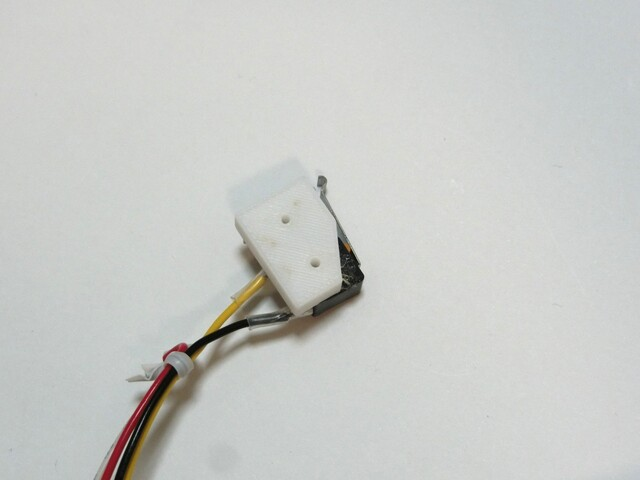

1. Glue the switch mount to one of the sliding plates. Check that the switch can
   be pressed by testing using one of the bump cap insert mounts.
   \
   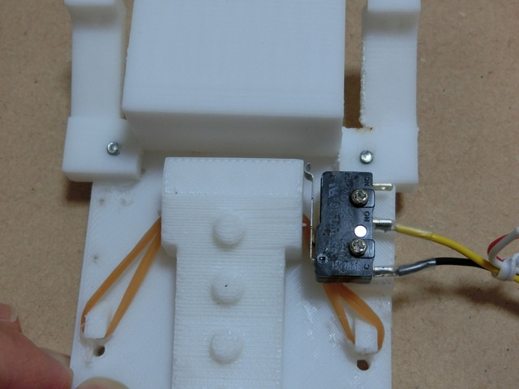

1. Attach the mounts to the left and right side of the cap, and adhere using hot
   glue. \
   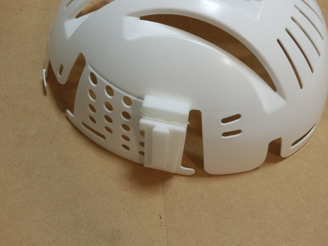

1. Combine the two parts by attaching the sliding plates to the rails on the
   bump cap insert mounts.

1. Attach M5StickC Plus and connect the other side of the Grove connector that
   is attached to the micro switch.

### Firmware

#### Step 1: Environment setup

- Arduino IDE
- Libraries
  - [Madgwick library](https://github.com/arduino-libraries/MadgwickAHRS)
    - You can install from Arduino IDE's Library Manager.
  - [ESP32 BLE Keyboard library](https://github.com/T-vK/ESP32-BLE-Keyboard)
    - You can download zip file from github and install from Sketch -> Include
      Library -> Add .ZIP Library menu in Arduino IDE.
  - [IMU Library](https://github.com/yamaguchi-am/m5stack-examples)
    - Download
      [imu.h](https://github.com/yamaguchi-am/m5stack-examples/blob/main/imu/imu.h)
      and
      [imu.cpp](https://github.com/yamaguchi-am/m5stack-examples/blob/main/imu/imu.cpp)
      from this repository and put them into firmware/ directory.

#### Step 2: Compile and upload

- Compile and upload the mozc-caps.ino firmware to the M5StickC Plus using
  Arduino IDE.

#### Step 3: Calibration

- IMU (gyro sensor) calibration
  - After powering on the M5StickC Plus, the firmware will run calibration for
    the IMU.
  - While the display shows "calibrating" message, keep the device still.
  - You can also trigger the calibration process by long-pressing Button A.
- Setting the origin direction
  - When Button A is pressed, the origin direction is set to the current
    orientation of the device.

#### Step 4: Connect

Connect the keyboard via Bluetooth to a PC or other device that has Google
Japanese Input/Gboard installed.

Note: This keyboard keeps sending keycodes even before you press the key. It is
for showing a preview of the selected character to be input on the connected
device.

## License

```
Licensed under the Apache License, Version 2.0 (the "License"); you may
not use this file except in compliance with the License. You may obtain
a copy of the License at

    http://www.apache.org/licenses/LICENSE-2.0

Unless required by applicable law or agreed to in writing, software
distributed under the License is distributed on an "AS IS" BASIS,
WITHOUT WARRANTIES OR CONDITIONS OF ANY KIND, either express or implied.
See the License for the specific language governing permissions and
limitations under the License.
```
