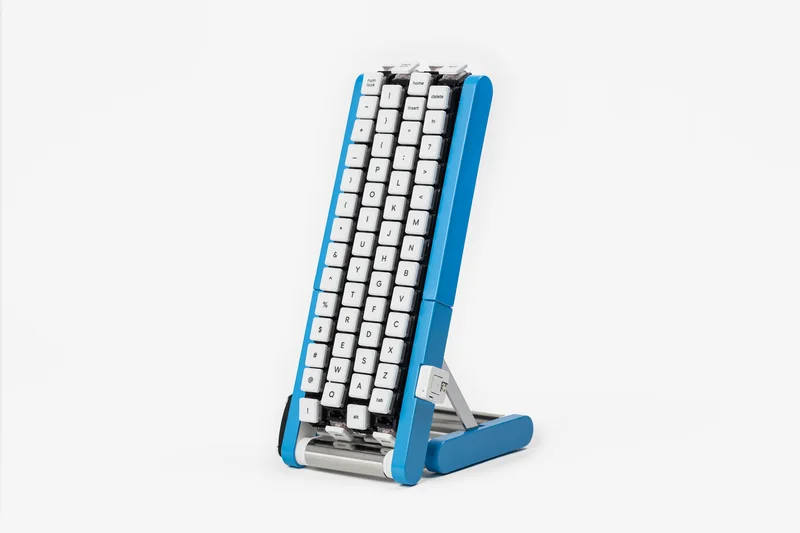

[Japanese version](./README_ja.md) is available.

# Gboard Conveyor Belt Version

This directory contains the design data and firmware for the Gboard Conveyor Belt Version, released on October 1, 2026.
The Gboard Conveyor Belt Version is not an official Google product.

## Contents

The directory structure is as follows:

- board/ : KiCad schematics and PCB layouts.
- firmware/ : Firmware source code and projects.
- stls/ : 3D printable STL files for the case and mechanisms.

## Let's build it

This year again, we are releasing 3D printing model data, board data, and firmware.

[Click here for the build guide](./buildguide.md)

## There's also a Gboard that doesn't come to you

For those who are accustomed to moving their hands for text input, we also offer the standard version of Gboard.

It provides a comfortable input experience in conjunction with various Google services such as voice input and translation functions.

[Available on Google Play](https://play.google.com/store/apps/details?id=com.google.android.inputmethod.latin) 
[Available on the App Store](https://apps.apple.com/us/app/gboard-the-google-keyboard/id1091700242)

## [Other versions](https://github.com/google/mozc-devices)

## License

See [LICENSE](../LICENSE) file in this directory.
