# ビルドガイド

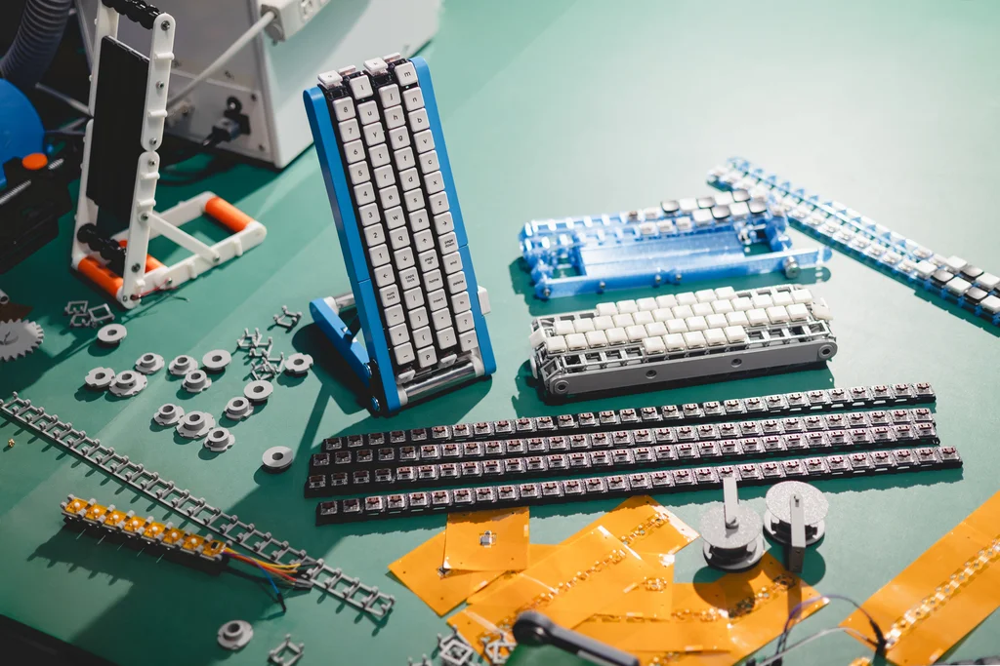

[プロジェクトの概要はこちら](./README_ja.md)

## ファイル一覧

- `stls/` : ケース・機構用 3D モデル (STL)
- [`board/`](./board/README_ja.md) : 回路・電子部品に関するドキュメント（今後公開予定）
- [`firmware/`](./firmware/README_ja.md) : ファームウェア開発リソース一式
- `firmware/prebuilt/` : コンパイル済みファームウェアバイナリ

## モデル

本キーボードには以下の2種類のモデルがあります。
- **キーが流れるモデル**: モーターでコンベアベルトが回転し、キーが流れるモデル
- **Bluetooth接続モデル**: Bluetooth接続で文字入力が可能なモデル（今後公開予定）

以下では、**キーが流れるモデル**の組み立て方を説明します。

## キーが流れるモデル

### 必要な部品 (BOM)

#### 3Dプリント品

| プレビュー | 部品名 | ファイル | 数量 | 備考 |
| :-: | :--- | :--- | :-: | :--- |
| 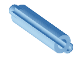 | Base_Roller | [`Base_Roller.stl`](./stls/Base_Roller.stl) | 2 | ベース部回転ローラー |
| 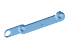 | Base_Side | [`Base_Side.stl`](./stls/Base_Side.stl) | 2 | ベース部左右メインサイドフレーム |
|  | BaseCoverL | [`BaseCoverL.stl`](./stls/BaseCoverL.stl) | 1 | ベース部 左側面カバー |
| 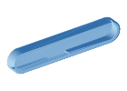 | BaseCoverR | [`BaseCoverR.stl`](./stls/BaseCoverR.stl) | 1 | ベース部 右側面カバー |
|  | BottomTube | [`BottomTube.stl`](./stls/BottomTube.stl) | 3 | 外径21mm 内径18mm L70mm のパイプも可 |
|  | BottomTubePlate | [`BottomTubePlate.stl`](./stls/BottomTubePlate.stl) | 1 | 下部チューブ軸受・保持プレート |
| 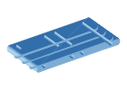 | Box | [`Box.stl`](./stls/Box.stl) | 1 | メイン筐体 |
|  | Cover_BottomL | [`Cover_BottomL.stl`](./stls/Cover_BottomL.stl) | 1 | 下部左側面カバー |
|  | Cover_Top | [`Cover_Top.stl`](./stls/Cover_Top.stl) | 2 | 上部側面カバー（左右共通） |
| 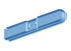 | Cover_wAtom | [`Cover_wAtom.stl`](./stls/Cover_wAtom.stl) | 1 | ATOMS3 Lite 取付用スロット付きカバー |
| 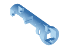 | MotorSupport | [`MotorSupport.stl`](./stls/MotorSupport.stl) | 1 | モーター＆ドライバー保持ブラケット |
| 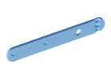 | SidePlate_Bottom | [`SidePlate_Bottom.stl`](./stls/SidePlate_Bottom.stl) | 2 | 下部インナーサイドプレート |
| 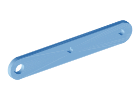 | SidePlate_Top | [`SidePlate_Top.stl`](./stls/SidePlate_Top.stl) | 2 | 上部インナーサイドプレート |
| 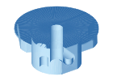 | SprocketA | [`SprocketA.stl`](./stls/SprocketA.stl) | 4 | スプロケットA（片面にのみ突起あり） |
| 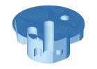 | SprocketB | [`SprocketB.stl`](./stls/SprocketB.stl) | 6 | スプロケットB（両面に突起があり、両面の突起の角度が同じ） |
|  | SprocketC | [`SprocketC.stl`](./stls/SprocketC.stl) | 6 | スプロケットC（両面に突起があり、両面の突起の角度がずれている） |
|  | Stay | [`Stay.stl`](./stls/Stay.stl) | 2 | t2mm 12×110mm |
|  | Belt | [`Belt.stl`](./stls/Belt.stl) | 116 | コンベアベルトのコマ（29個×4列） |

#### 機械部品・ねじ類

| 品名 | 数量 | 備考・参考リンク |
| :--- | :-: | :--- |
| 3mm L105mm シャフト | 2 | [参考リンク](https://www.amazon.co.jp/dp/B0DS8YLN65)（こちらを105mmにカット） |
| Insert Nut M4 x 4mm x 5mm | 14 | [参考リンク1](https://www.amazon.co.jp/dp/B0DJ8C9PJN) / [参考リンク2](https://www.amazon.co.jp/dp/B0FFGZKGJC) |
| Insert Nut M2.5 x 3.5mm x 3.5mm | 8 | [参考リンク](https://www.amazon.co.jp/dp/B0FVD9XB56) |
| 六角穴付イモネジ M2.5 x 4mm | 4 | [参考リンク](https://www.amazon.co.jp/dp/B0F4Q98MY7) |
| 六角穴付きボルト M4 x 8mm | 12 | [参考リンク](https://www.amazon.co.jp/dp/B0DDWLZYRK) |
| 六角穴付きボルト M4 x 6mm | 2 | [参考リンク](https://www.amazon.co.jp/dp/B002A5KK76) |
| 六角穴付きボルト M2.5 x 8mm | 4 | [参考リンク](https://www.amazon.co.jp/dp/B0FLYCZ4R2) |
| タイミングプーリー 2GT ベルト幅6mm 20T 穴径3mm | 2 | [参考リンク](https://www.amazon.co.jp/dp/B09Y1N3WXT) |
| タイミングベルト 2GT 幅6mm 長さ110mm | 1 | [参考リンク](https://www.amazon.co.jp/dp/B0CNT721G6) |
| ベアリング 623ZZ 内径3mm 外径10mm 幅4mm | 4 | [参考リンク](https://www.amazon.co.jp/dp/B0G6ZG3Z8F) |
| ベアリング MR63ZZ 内径3mm 外径6mm 幅2.5mm | 1 | [参考リンク](https://www.amazon.co.jp/dp/B0CFZQRL8C) |
| 3mmシャフトカラー 8mm外径 4mm幅 | 3 | [参考リンク](https://www.amazon.co.jp/dp/B0CQNYN2N6) |

#### 電子部品

| 品名 | 数量 | 備考・参考リンク |
| :--- | :-: | :--- |
| モータードライバー DRV8833 | 1 | [参考リンク](https://www.amazon.co.jp/dp/B098Q24ZV9) |
| DC6V N20メタルギアードモーター 3mmシャフト 150RPM | 1 | [参考リンク](https://www.amazon.co.jp/dp/B0FZFKGC6F) |
| ATOMS3 Lite | 1 | [参考リンク](https://www.switch-science.com/products/8778) |
| 2.54mm ピンヘッダ 4P | 1 | [参考リンク](https://www.amazon.co.jp/dp/B0829W3T8Q) |
| 2.54mm ピンヘッダ 5P | 1 | |
| 220μF 電解コンデンサ | 1 | [参考リンク](https://www.amazon.co.jp/dp/B07D3P2NFY) |
| 0.1μF セラミックコンデンサ | 1 | [参考リンク](https://www.amazon.co.jp/dp/B079YJ78VS) |
| ロープロファイルスイッチ (Kailh Choc V1) | 116 | [参考リンク](https://shop.yushakobo.jp/collections/all-switches/products/pg1350) |
| ロープロファイルキーキャップ (Kailh Choc V1) | 116 | [参考リンク](https://shop.yushakobo.jp/collections/choc-v1-keycaps/products/pg1350cap-blank) |

### 組み立て

#### Step 1: 3Dプリント部品の準備とインサートナットの圧入

1. 上記部品表の 3D プリント部品（全18種・計157個）を出力します。`BottomTube`（3個）は外径 21mm・内径 18mm・長さ 70mm のパイプで代用することも可能です。
2. はんだごて等を使用して、M4 インサートナット（14個）を `Base_Side`（1箇所×2個）、`Base_Roller`（両端2箇所×2個）、および `Box`（両側面4箇所×2面）に熱圧入します。

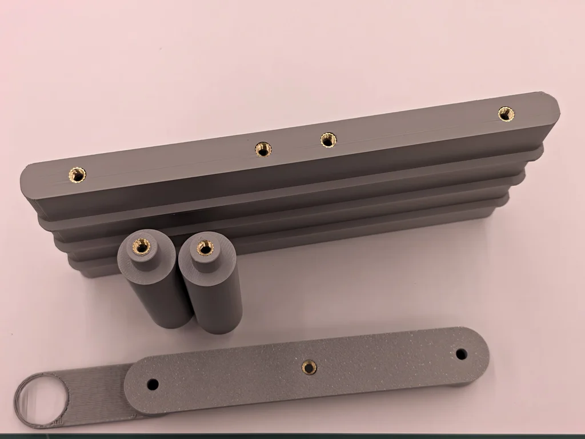

3. M2.5 インサートナット（8個）を `MotorSupport`（2箇所）、`BottomTubePlate`（2箇所）、および `SprocketA` のボス側面（1箇所×4個）に熱圧入します。

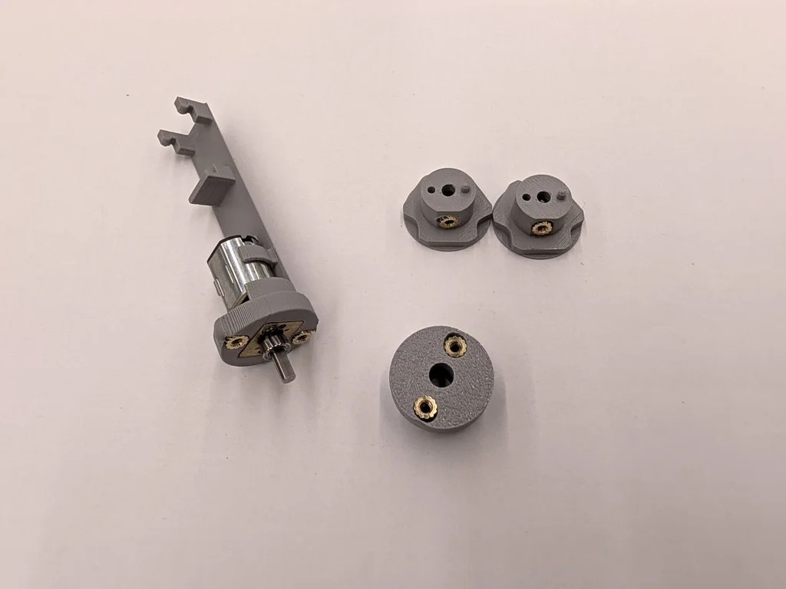

#### Step 2: ベースの組み立て

1. `MotorSupport` に DC6V N20 メタルギアードモーター（150RPM）とモータードライバー `DRV8833` を取り付けます。
2. `BottomTube`（3個）、`Base_Roller`（2個）、`Base_Side`（2個）、`BottomTubePlate`（1個）、および `MotorSupport`（1個）を組み合わせてベース部を組み立て、M4 六角穴付きボルトで固定します。電源ケーブルは `BottomTubePlate` の穴から `BottomTube` の内部を通して配線します。

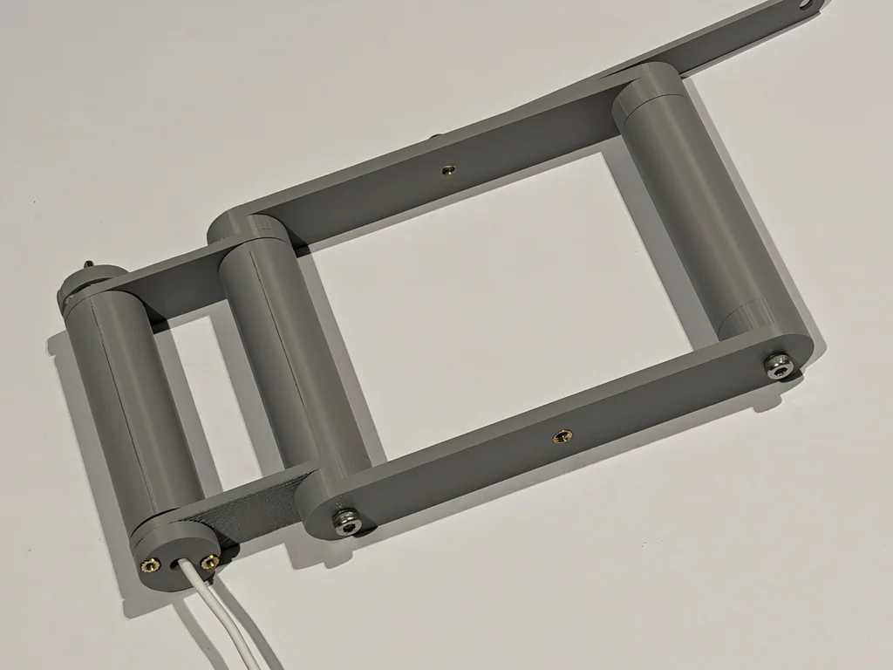

#### Step 3: シャフト・スプロケットの組み立て

1. 3mm シャフト（長さ 105mm、2本）のそれぞれに、スプロケットを **`SprocketA`、`SprocketB`、`SprocketC`、`SprocketB`、`SprocketC`、`SprocketB`、`SprocketC`、`SprocketA`** の順（1本あたり8個、2本で計16個）に通し、両端に `623ZZ` ベアリングを通します（計4個）。1本は両端、もう1本は片方を 3mm シャフトカラーで止めます（計3個）。
2. `SprocketA` のボス穴に六角穴付イモネジ（M2.5 × 4mm、4個）を締め込み、シャフトに固定します。

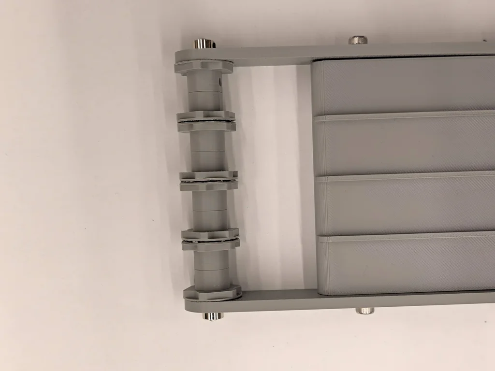

#### Step 4: フレーム・駆動機構の組み立て

1. メイン筐体 `Box` を中央に配置し、シャフトを挟み込むようにして `SidePlate_Bottom`、`SidePlate_Top`、および連結補強用の `Stay`（2個）を六角穴付きボルト（M4 × 8mm、M4 × 6mm、M2.5 × 8mm）で締結します。
2. モーターの 3mm 軸と、シャフトの残りの端（シャフトカラーを付けていない側）に 2GT タイミングプーリー（20T、計2個）を取り付けます。
3. モーター側のプーリーと駆動シャフト側のプーリーに 2GT タイミングベルト（幅 6mm、長さ 110mm）を掛けます。
4. コンベアベルトのコマ `Belt`（29個×4列＝116個）を4本の輪にしてロープロファイルスイッチとキーキャップを取り付け、ローラー群に巻き付けます。

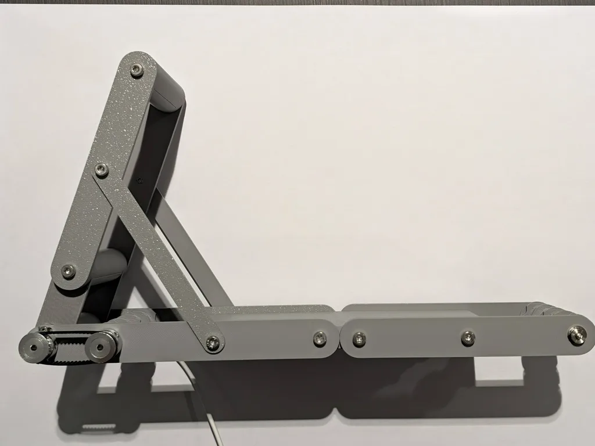

#### Step 5: 電装系の組み付け

1. `Cover_wAtom` の専用スロットに `ATOMS3 Lite` を装着し、`DRV8833` およびコンデンサ（220μF 電解コンデンサ、0.1μF セラミックコンデンサ）を配線します。

#### Step 6: 外装カバーの取り付け

1. 外装カバー（`BaseCoverL`、`BaseCoverR`、`Cover_BottomL`、`Cover_wAtom`、`Cover_Top` × 2）を側面から取り付け、ボルトで固定して完成です。

## Bluetooth接続モデル

今後公開予定。
