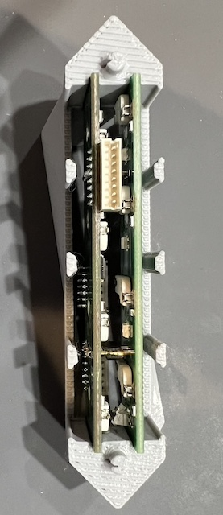
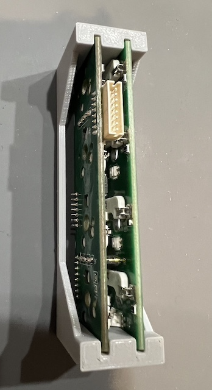
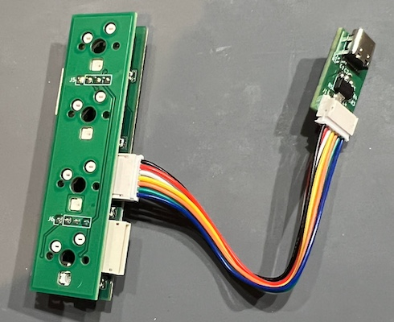
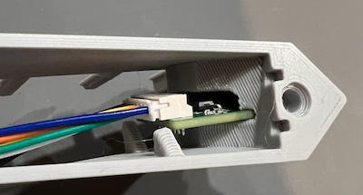
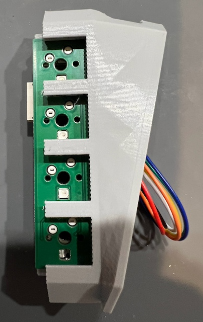

# Gboard 両面バージョン

このディレクトリは 2024 年 10 月 1 日にリリースされた Gboard 両面バージョンの設計データとファームウエアを含んでいます。

Gboard 両面バージョンは正式な Google 製品ではありません。

## 内容

このディレクトリには以下の物が含まれています。

-   case/ : ケース用のSTLファイル
-   board/ : KiCad用の回路図と基板のレイアウトデータ
-   firmware/ : STM32CubeIDE向けファームウェア開発リソース一式
-   gerber/ : 基板製造用ガーバーデータと組み立て用の配置情報

## Gboard 両面バージョンの制作

### 部品

-   組み立て済みAタイプ基板: 26個（プライマリ基板1枚を含む） - 下記の部品表を参照
-   組み立て済みBタイプ基板: 26個（プライマリ基板1枚を含む） - 下記の部品表を参照
-   USB基板: 1個 - 下記の部品表を参照
-   ケーブルA（JST ZH 1.5mmピッチ 8ピン 100mm長 ストレート結線 両面メス）: 25個
-   ケーブルB（JST ZH 1.5mmピッチ 7ピン 100mm長 ストレート結線 両面メス）: 1個
-   ピンヘッダ（2.54mmピッチ 1x4ピン 12mm以上の高さ,
    [参考](https://akizukidenshi.com/catalog/g/g101382/)): 52個
-   3D プリントしたケース部品 : 26種類1つずつ
-   セルフタッピングビス(M2): 52本
-   キースイッチ(Cherry MXもしくは相当品): 208個
-   キーキャップ(Cherry MXスイッチ用): 208個

#### Aタイプ基板 部品表

参照名     | 内容                                 | 数   | 備考
------- | ---------------------------------- | --- | ---------
R1-R2   | 0402(1005) 抵抗 510 Ω                | 2   |
R3-R4   | 0603(1608) 抵抗 1K Ω                 | 2   | プライマリ基板のみ
J2-J3   | JST S8B-ZR                         | 2   |
J4      | JST S7B-ZR                         | 1   | プライマリ基板のみ
U1      | STMicro STM32F042F4P6              | 1   |
SW1-SW4 | Kailh CPG151101S11-1               | 4   |
D1-D4   | OPSCO Optoelectronics SK6812MINI-E | 4   |
D5-D8   | 0805(2012) 小信号用スイッチングダイオード         | 4   |
C1      | 0402(1005) コンデンサ 0.1uF             | 1   |

プライマリ基板のみの部品は基板組立データには含まれていないため、別途手作業で組み立てるために調達して下さい。

#### Bタイプ基板 部品表

参照名     | 内容                                 | 数   | 備考
------- | ---------------------------------- | --- | ---
R2      | 0402(1005) 抵抗 510 Ω                | 1   |
SW1-SW4 | Kailh CPG151101S11-1               | 4   |
D1-D4   | OPSCO Optoelectronics SK6812MINI-E | 4   |
D5-D8   | 0805(2012) 小信号用スイッチングダイオード         | 4   |

#### USB基板 部品表

参照名   | 内容                         | 数   | 備考
----- | -------------------------- | --- | ---
U1    | 1A/3.3V レギュレータ AMS1117-3.3 | 1   |
R1-R2 | 0402(1005) 抵抗 5.1K Ω       | 2   |
R3-R4 | 0402(1005) 抵抗 22 Ω         | 2   |
R5    | 0402(1005) 抵抗 1.5K Ω       | 1   |
J1    | JST S7B-ZR                 | 1   |
J2    | USB Type-C 16ピン コネクタ       | 1   |
C1    | 0402(1005) コンデンサ 10uF      | 1   |
C2    | 0402(1005) コンデンサ 2.2uF     | 1   |
C3-C4 | 0402(1005) コンデンサ 47pF      | 2   |

### ハードウェア

#### ステップ1: 3Dプリント用パーツの準備

`case/` ディレクトリにはケース用のSTLファイルがあります。 ケースは26個のパーツからなります (parts00.stl -
parts25.stl)。 それぞれのパーツの内側にはパーツ番号が刻印されています。 例えばパーツ0の突起をパーツ1に差し込む形で組み立てる事になります。

また、基板AタイプとBタイプをはんだ付けするための治具が `case/jig.stl` も用意してありますので、これも印刷しておきます。

#### ステップ2: 基板の準備

**基板の製造と組立**

まず、Aタイプ、Bタイプそれぞれの基板を26枚ずつ、USB基板を1枚作る必要があります。 `gerber/`
ディレクトリにあるガーバーデータ、BOMデータ、CPLデータを参考にして下さい。

基板タイプ | ガーバー           | BOM                | CPL
----- | -------------- | ------------------ | ------------------------
Aタイプ  | main_panel.zip | main_panel_bom.csv | main_panel_positions.csv
Bタイプ  | sub_panel.zip  | sub_panel_bom.csv  | sub_panel_positions.csv
USB   | usb.zip        | usb_bom.csv        | usb_positions.csv

Aタイプ、Bタイプ基板向けのデータは9個の基板がパネル化されたデータになっています。
このパネル化されたデータで3枚製造すると、27枚（必要な26枚と予備1枚）の基板が得られます。 USB基板は単体で1枚だけ必要です。

**ファームウェア書き込み**

次にファームウェアを書き込みます。

図のSWDIO、SWCLK、GND、そして+3.3Vの端子をST-LINKと繋ぎます。
[STM32CubeProgrammer](https://www.st.com/ja/development-tools/stm32cubeprog.html)
を使って設定やファームウェアの書き込みを行えます。 コネクタ等は用意されていない生の端子なので、きちんと接触するように注意しながら書き込みます。

Aタイプ基板との接続が確立したら、まず`Option bytes`を書き込みます。 `User
Configuration`の項に`BOOT_SEL`があるので、そのチェックを外して`Apply`ボタンを押して設定を更新します。

次に`Erasing & Programming`の項からファームウェアを書き込みます。
`Browse`ボタンを押して`firmware/prebuilt/mozc.elf`を選びます。 `Start
address`には`0x08000000`を指定し、`Start Programming`ボタンを押します。

同様にして全てのAタイプ基板に設定とファームウェアを書き込みます。

**プライマリAタイプ基板固有の実装**

以下の3つの部品をプライマリ基板にのみ実装します。

1.  J4 JST S7B-ZR コネクタ ヘッダ端子
2.  R3 0603(1608) 抵抗 1K Ω
3.  R4 0603(1608) 抵抗 1K o

**A/Bボードペアモジュールの作成**

26対のAタイプ基板、Bタイプ基板のペアモジュールを作成する必要があります。 下図のように、`P Connector`と`S
connector`それぞれ同じコネクタ同士を1x4のピンヘッダで連結します。

この最、`IN`と書かれた基板面がそれぞれ内側を向くように注意しましょう。

また、基板の距離がケースにフィットするよう適切に調整されている必要があります。 この作業用の特別なケースを3Dプリントして用いると効率的に作業できます。
実際のケースを使って確認しながら作業する事も可能です。

#### ステップ3: 基板をケースに入れる

**プライマリモジュール固有の作業**

まず、プライマリモジュールとUSB基板をケーブルで接続します。

次にUSB基板を0番のケースに格納します。

**全てのモジュール共通の作業**

全てのペアモジュールを0から25番のケースにそれぞれ格納します。 Aタイプ基板が常に下側になるよう気をつけます。

#### ステップ4: ケース同士を連結する

`UP`端子と`DOWN`端子の対をケーブルで接続していきます。 同じ端子同士を誤って接続しないよう注意して下さい。
電源を入れた時にショートによりチップが焼け焦げる事になります。 （匂いや煙に気づいたら直ぐに電源を抜けば壊れずに済むことも多いです）

次の全体図を参考にしてください。 最初のモジュール0と最後のモジュール25は接続されていない事に注意します。

また、この図は簡単のために本来発生する「ねじれ」を考慮した図になっていません。 実際に組み立てた際にはモジュール25は上下逆さの向きになります。

ネジを使って各ボード間をしっかり固定してください。

### ファームウェア

#### ステップ1: 開発環境の構築

STMicroelectronics社公式のSTM32開発ツールが必要になるので、以下からインストールします。

-   [STM32CubeIDE](https://www.st.com/en/development-tools/stm32cubeide.html) -
    1.16.1にて確認
-   [STM32CubeMX](https://www.st.com/en/development-tools/stm32cubemx.html) -
    6.12.1にて確認

また、Windows以外の環境では、Visual Studio CodeにSTM32 VS Code Extensionをインストールする事でも開発できます。
STM32CubeMXとSTM32CubeCLTを別途公式からインストールする必要があります。

-   [Visual Studio Code](https://code.visualstudio.com/) - 1.93.0にて確認
-   [STM32 VS Code Extension](https://marketplace.visualstudio.com/items?itemName=stmicroelectronics.stm32-vscode-extension) -
    2.1.0にて確認
-   [STM32CubeCLT](https://www.st.com/en/development-tools/stm32cubeclt.html) -
    1.16.1にて確認 VS Code ExtensionではCLTのパスを設定するよう指示がでるかもしれません。
    その際には以下を参考に`.vscode/settings.json`へ設定を書いて下さい。 `{
    "STM32VSCodeExtension.cubeCLT.path": "/opt/ST/STM32CubeCLT_1.16.1" }`

また、書き込みには[ST-LINK](https://www.st.com/ja/development-tools/st-link-v2.html)などのデバイスが必要になります。

#### ステップ2: コンパイルと書き込み

**STM32CubeIDEの場合**

1.  STM32CubeIDEを起動し、`mozc-doublesided`ディレクトリを`workspace`として指定します。
2.  `Start new project from STM32CubeMX file (.ioc)`から設定ダイアログを開きます。
3.  `STM32CubeMX .ioc
    file`として`firmware/mozc-doublesided.ioc`を選び、`Finish`ボタンを押して必要なリソースを生成します。
4.  パッチをあてます（後述）
5.  `Project > Build Configurations > Set Active > 2 Release`から
    アクティブプロジェクトを`Release`に指定します。 `Debug`ではプログラムが大きくなりメモリに入り切りません。
6.  `Project > Build All`からビルドします。

ファームウェアは`firmware/Release/firmware.elf`として生成されます。

**Visual Studio Codeの場合**

1.  STM32CubeMXから`firmware/mozc-doublesided.ioc`を開き、`GENERATE CODE`を押します。
    追加で何かインストールを促された場合には指示に従ってください。
2.  Codeを起動し、`firmware`を開きます。
3.  パッチをあてます（後述）
4.  ビルドプリセット設定から`Release`か`RelWithDebInfo`を選びます。
    `Debug`ではプログラムが大きくなりメモリに入り切りません。
5.  ステータスバーから`Build`を押します。他のUIからビルドする方法もありますが、ここでは触れません。

ファームウェアは`build/Release/firmware.elf`として生成されます。

もしリンク時に`STM32F042F6Px_FLASH.ld`が原因でエラーが出ていたら、該当ファイルに修正を加える必要があります。

パッチを用意したので`patch < STM32F042F6Px_FLASH.ld.diff`をお試し下さい。

**パッチ手順**

`firmware`ディレクトリにて、以下のコマンドで生成されたファイルに`firmware.diff`をパッチとして適用して下さい。

`$ patch -p1 < firmware.diff`

## ライセンス

このディレクトリに置かれた[LICENSE](../LICENSE)ファイルを参照してください。
