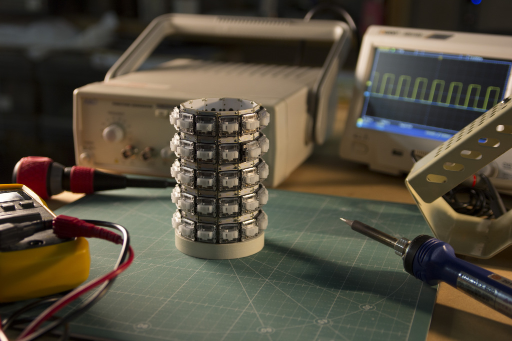
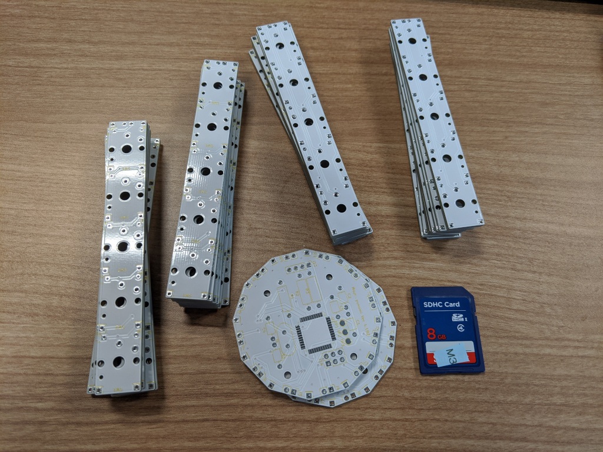
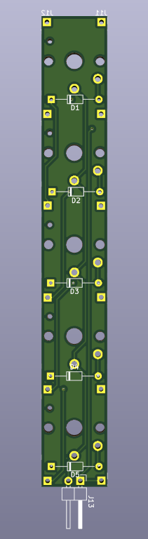
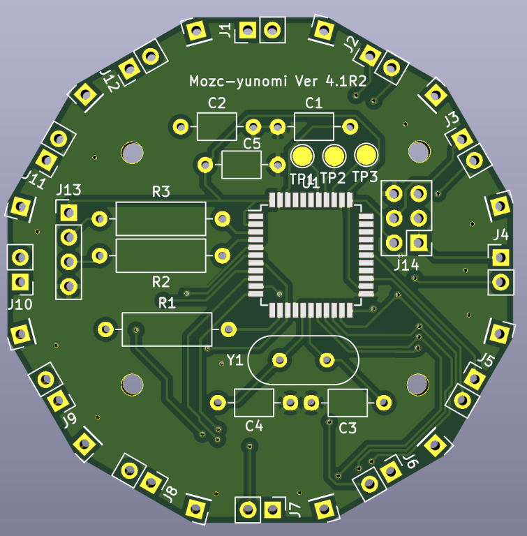
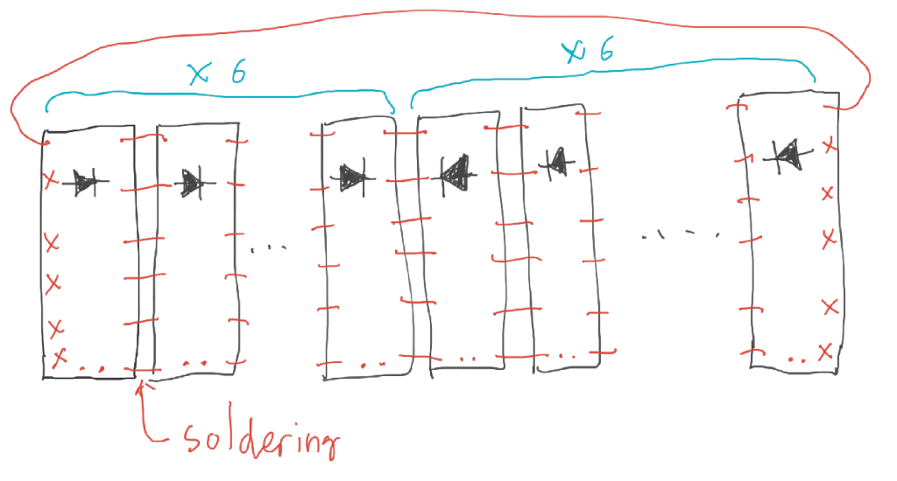
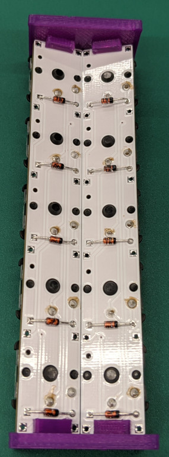
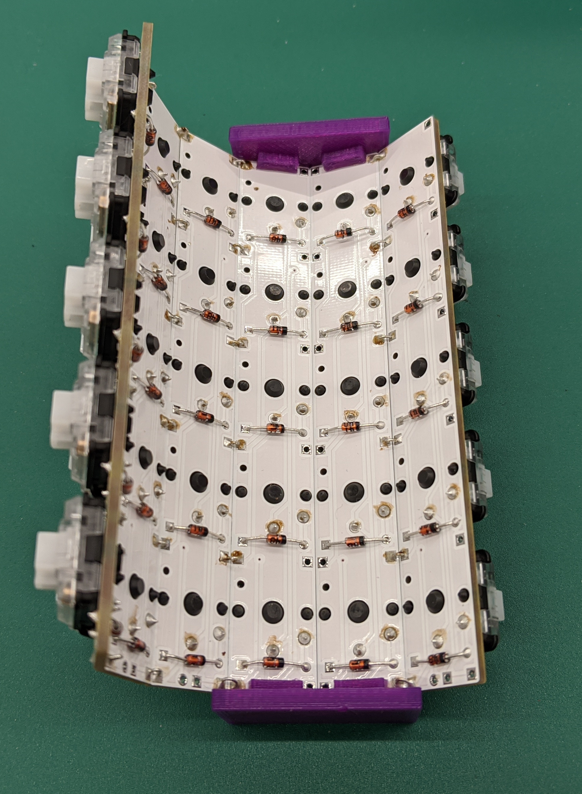
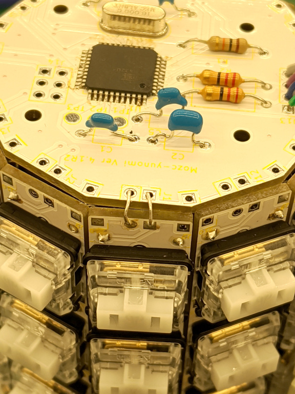

# Gboard Yunomi version

This contains programs, schematics and board layouts for Gboard Yunomi version,
which was released on **Oct 1, 2021**.

This is not an officially supported Google product.

## Contents

The directory structure is as follows:

-   firmware/ : Arduino sketch.
-   board/ : KiCad schematics and PCB layouts.
-   jig.stl : A jig for building the keyboards.
-   ../third_party/mozc-yunomi/keyswitches.pretty : Footprint data for the key
    switches.

## Building Gboard Yunomi Version



### Parts

-   Kailh choc key x60
-   Diode (1N4148) x60
-   ATMega32U4-AU (QFP)
-   Resistor 10kOhm
-   Resistor 22Ohm x2
-   Capacitor 0.1uF
-   Capacitor 1uF x2
-   Capacitor 22pF x2
-   Crystal 16MHz (HC-49)
-   USB-C connector breakout (4pin)

### PCBs

We need two types of PCBs to build this project.



#### Key-PCB



Shape: Rectangular.

Components: Diodes and key switches.

Number of PCBs required: 12

#### Base-PCB:



Shape: Dodecagonal

Component2: ATMega32u4.

### Steps to build

#### Step 1

Solder diodes D1 to D5 onto the twelve Key-PCBs at the silk-screened locations.

*IMPORTANT:* Diodes on six of the Key-PCB should be placed in the opposite
direction.

For six of the PCBs, we can solder diodes as indicated by the silk-screen. For
the other six PCBs, we need to solder the diodes in the opposite direction.

#### Step 2

Solder key-switches to each Key-PCB. Note that the diodes need to be placed on
the opposite side of the Key-PCB to the key-switches, as shown by the
silk-screen.

#### Step 3

Create a cylindrical shape by combining the 12 Key-PCBs.

There are six connection points between each pair of Key-PCBs. Connect adjacent
pairs of boards by soldering the tin-plated wires (see the picture).

However, only connect J11 and J12 between the first and last Key-PCB, instead of
all six locations.







If you have a 3D printer, you may print and use jig.stl to help with this step.

#### Step 4

Solder all parts for Base-PCB.

#### Step 5

Connect Base-PCB to the cylinder made in Step 3.



#### Step 6

Install the
[Arduino caterina bootloader](https://github.com/arduino/ArduinoCore-avr/blob/master/bootloaders/caterina/Caterina-Leonardo.hex)
using AVRISP or other ISP tool.

#### Step 7

Install firmware using the Arduino IDE.

#### Step 8

Connect the keyboard to a PC or other device that has Google Japanese
Input/Gboard installed.

## License

```
Licensed under the Apache License, Version 2.0 (the "License"); you may
not use this file except in compliance with the License. You may obtain
a copy of the License at

    http://www.apache.org/licenses/LICENSE-2.0

Unless required by applicable law or agreed to in writing, software
distributed under the License is distributed on an "AS IS" BASIS,
WITHOUT WARRANTIES OR CONDITIONS OF ANY KIND, either express or implied.
See the License for the specific language governing permissions and
limitations under the License.
```
