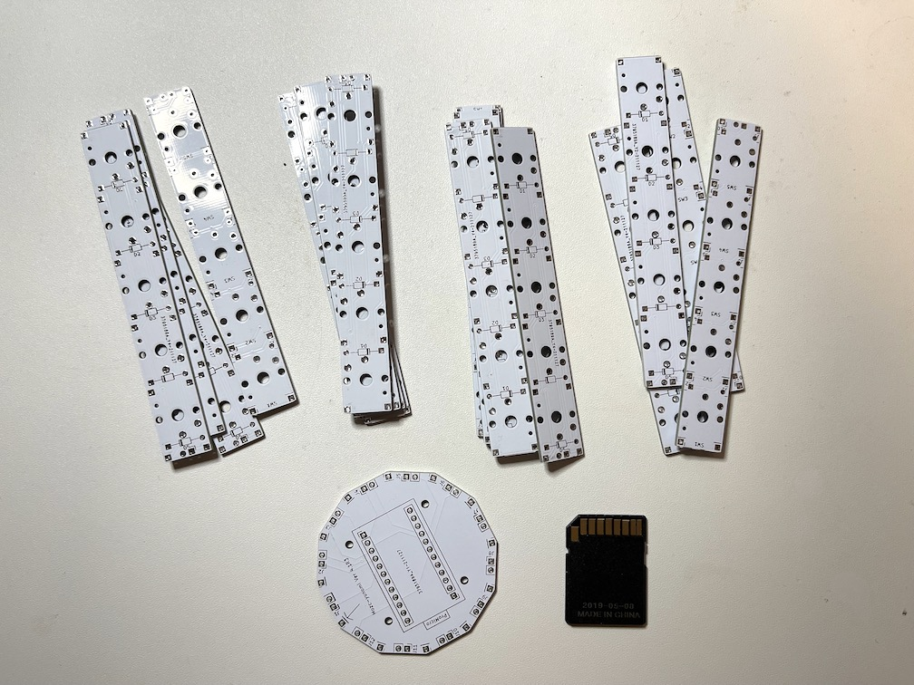
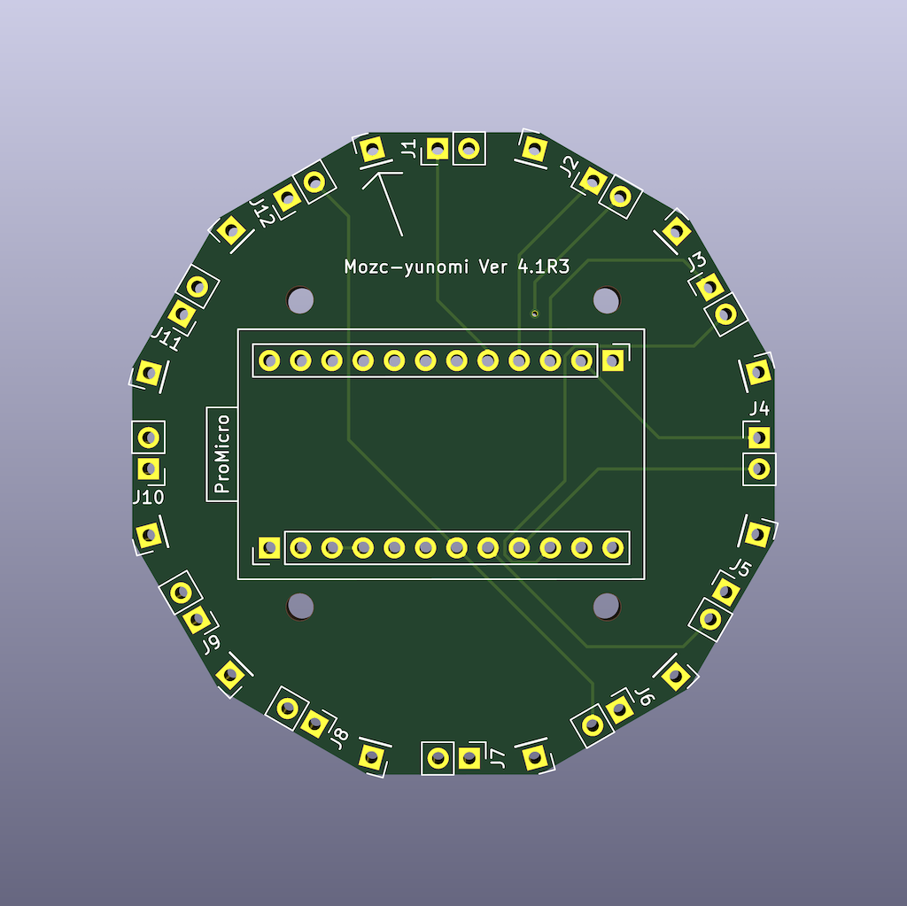
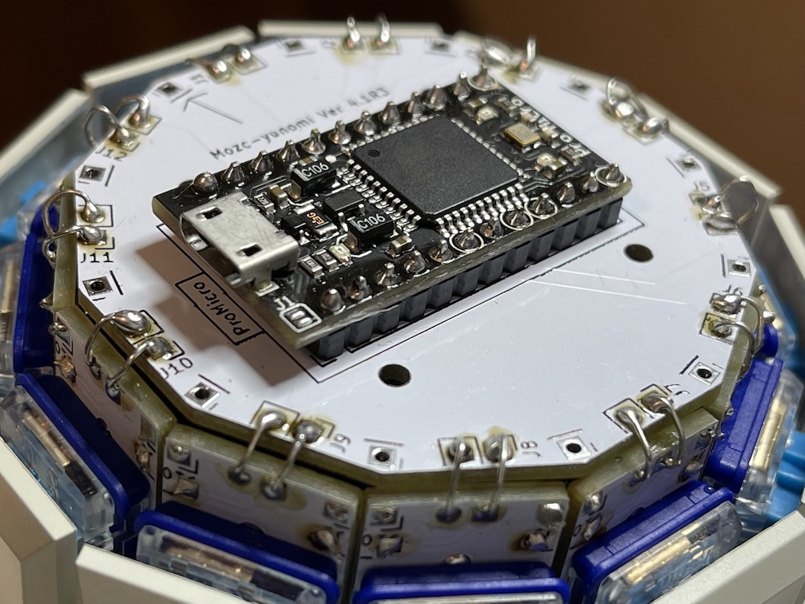
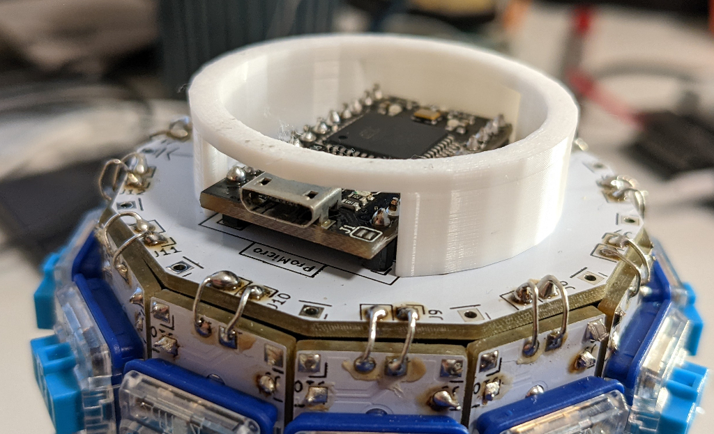

# Gboard Yunomi version with Pro Micro

This is an instruction to build the Gboard Yunomi version with Pro Micro.
For the general information about the Gboard Yunomi version, please refer to [the project README](./README.md).

### Parts

-   Kailh choc key x60
-   Diode (1N4148) x60
-   Pro Micro x1

### PCBs

We need two types of PCBs to build this project.

#### Key-PCB

File location: board/key

Shape: Rectangular

Components to be soldered: Diodes and key switches

Number of PCBs required: 12

#### Base-PCB:

File location: board/base-promicro

Shape: Dodecagonal

Components to be soldered: Pro Micro

Number of PCBs required: 1

### Steps to build

#### Step 1

Solder diodes D1 to D5 onto the twelve Key-PCBs at the silk-screened locations.

*IMPORTANT:* Diodes on six of the Key-PCBs should be placed in the opposite
direction.

In other words, you can solder diodes as indicated by the silk-screen for six of them, and you need to solder diodes in the opposite direction for the rest six.

#### Step 2

Solder key-switches to each Key-PCB. Note that the diodes need to be placed on
the opposite side of the Key-PCB to the key-switches, as shown by the
silk-screen.

#### Step 3

Create a cylindrical shape by combining the 12 Key-PCBs.

There are six connection points between each pair of Key-PCBs. Connect adjacent
pairs of boards by soldering the tin-plated wires (see the picture).

However, only connect J11 and J12 between the first and last Key-PCB, instead of
all six locations.

If you have a 3D printer, you may print and use jig.stl to help with this step.

#### Step 4

Solder a Pro Micro to the Base-PCB.

#### Step 5

Connect Base-PCB to the cylinder made in Step 3.

#### Step 6

Install [firmware](./firmware/firmware.ino) using the Arduino IDE. Note that you need to uncomment the line 2 (`#define PRO_MICRO`) to make it work with the Pro Micro version.

#### Step 7 (Optional)

Print and mount the platform (./platform_promicro.stl).

#### Step 8

Connect the keyboard to a PC or other device that has Google Japanese
Input/Gboard installed. Enjoy!
