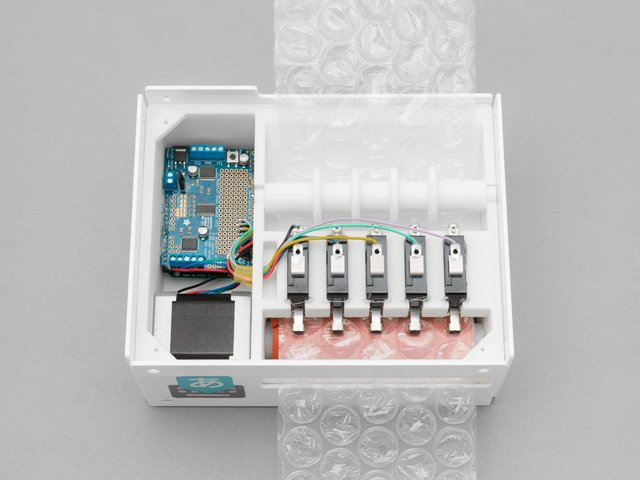

 Summary
=====================================

Mechanical design, circuit diagram and firmware of Google Japanese Input
puchi-puchi version.

 Building your device
=====================================

## Electronic parts

### Desktop type

* Arduino Leonard
* Adafruit motor driver shield
* Microswitch * 5
* LED * 5
* 330[ohm] Resistors * 5

### Handheld type

* Arduino Micro
* Microswitch * 5

 Files
=====================================

* README.md ----> this file
* LICENSE ----> license file
* circuit/
   * circuit.jpg ----> circuit diagram of both desktop/handheld devices
* desktop/
   * 3Dprinter ----> data to print for 3D printer
      * desktop.igs
      * desktop.stl
      * desktop.stp
   * Arduino/ ----> Arduino sketch file to drive board (Leonard)
      * desktop/desktop.ino
* handheld/
   * 3Dprinter/ ----> data to print for 3D printer
      * handheld.igs
	  * handheld.stl
	  * handheld.stp
   * Arduino/ ----> Arduino sketch file to drive board (Arduino Micro)
      * handheld/handheld.ino
